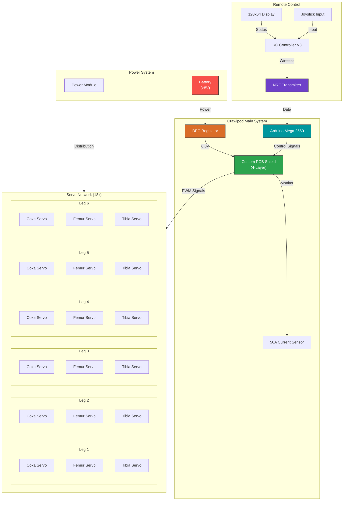

# Crawlpod - Hexapod Robot Project

<div align="center">


*A 3D-printed, Arduino-powered hexapod robot with custom PCB, remote control, and personality!*

</div>

---

## Overview

Crawlpod is an open-source hexapod robot project featuring a six-legged walking machine built with 3D-printed components, powered by an Arduino Mega, and controlled via custom remote controllers. The robot demonstrates advanced locomotion using a tripod gait pattern, allowing stable movement across various surfaces.

**What makes Crawlpod special:** This robot is not just a technical project - it has *personality*! With Portal-style armor, drink-carrying capability, and fluid insect-like movements, Crawlpod is the perfect combination of technology and character.

## System Architecture

The following diagram illustrates the complete system architecture of Crawlpod:



### System Components


#### Remote Control System
- **RC Controller V3**: Main control unit with joystick input
- **NRF Transmitter**: Wireless communication module
- **128x64 Display**: Status display for feedback

#### Main System (Robot)
- **Arduino Mega 2560**: Brain of the robot
- **Custom PCB Shield (4-Layer)**: Custom circuit board with integrated current sensing
- **BEC Regulator**: Voltage regulation for servos (6.8V output)
- **50A Current Sensor**: Power consumption monitoring for safety

#### Servo Network
- **18 Servos Total**: 3 servos per leg (Coxa, Femur, Tibia)
- **6 Legs**: Coordinated movement using tripod gait pattern

#### Power System
- **Battery (>8V)**: Main power source
- **BEC**: Steps down voltage to 6.8V for servos

## Features

### Locomotion & Movement

- **6 Walking Gaits**: Tripod, Ripple, Wave, Quadruped, Bipedal, and Hop
- **18 Degrees of Freedom**: Smooth and natural movement
- **Dynamic Stride Length**: Adaptive to different surfaces
- **Bezier Curves**: Smooth and precise movement

### Robot States

The robot has various states for different behaviors:

| State | Description |
|-------|-------------|
| **Initialize** | Startup and calibration |
| **Stand** | Standing still |
| **Car** | Carrying mode (transporting items) |
| **Crab** | Sideways movement |
| **SlamAttack** | Aggressive attack mode |
| **Sleep** | Power-saving mode |
| **Calibrate** | Calibration offsets |
| **Attach** | Attachment installation |

### Hardware Features

- **3D-Printed Body**: Lightweight and customizable with PLA/PLA+
- **Custom PCB Shield**: 4-layer with ground layer
- **High-Torque Servos**: US 3230 for powerful movement
- **6 Limit Switches**: For detection and safety
- **EEPROM Storage**: Store offsets and settings
- **Snap-Fit Assembly**: Easy assembly without soldering for frame

### Remote Control Features

- **Multiple RC Versions**: V1, V2, and V3 iterations
- **NRF Communication**: Reliable wireless link
- **Real-time Feedback**: Status display on controller
- **Gait Selection**: Choose walking gait from controller

## Hardware Specifications

| Component | Specification |
|-----------|----------------|
| Main Controller | Arduino Mega 2560 |
| Servos | US 3230 High-Torque Servos (18x) |
| Power | Battery with BEC regulation (6.8V for servos) |
| PCB | Custom 4-layer shield with ground layer |
| Current Sensor | 50A for power monitoring |
| Limit Switches | 6x for leg position detection |
| 3D Printer | AnkerMake M5 (recommended) |
| Frame Material | PLA/PLA+ 3D-printed parts |

## Robot Personality & Customization

What makes Crawlpod unique is its **customization capability**:

### Attachments

- **Leg Spikes**: For an aggressive battle-bot look
- **Leg Armor**: Protective plates with Portal style
- **Roll Cage**: Top frame with mounting points
- **Cup Holders**: Carry 2 soda cans - perfect for delivery bot!

### Fun Features

- **Soda Delivery Bot**: Robot that delivers drinks
- **Cat-Friendly**: Designed to interact with pets
- **Sci-Fi Aesthetic**: Futuristic Portal-inspired look

---

## Project Structure

```
Crawlpod/
├── Hexapod_Code/          # Main hexapod control firmware
│   ├── Hexapod_Code.ino   # Main state machine
│   ├── Bezier.ino         # Smooth movement curves
│   ├── Attacks.ino        # Attack movements
│   ├── Sleep_State.ino     # Power-saving mode
│   └── ...
├── RC_V1/RC_Code/         # Remote Controller V1 firmware
├── RC_V2/                  # Remote Controller V2 files
├── RC_V3/                  # Remote Controller V3 files
│   ├── RC Code/            # RC firmware
│   └── STL's/              # RC case files
├── PCB/                    # Custom PCB designs
├── CAD STLs/              # 3D printable STL files
├── CAD STLs V2/           # Updated CAD files
├── Gear Stuff/            # Mechanical gear components
├── Mini Hex/              # Mini version components
├── AnkerMake Parameters/  # 3D printer settings
└── RC Controller UI Mock Up/  # UI mockups for RC display
```

## Getting Started

### Prerequisites

- Arduino IDE or PlatformIO
- Arduino Mega 2560
- USB cable for programming
- Soldering equipment for PCB assembly
- 3D printer (0.2mm layer height recommended)

### Assembly

1. **Print Components**: Use the STL files in `CAD STLs/` directory
2. **Assemble Frame**: Follow the snap-fit design or use screws with heat-set inserts
3. **Install Servos**: Mount US 3230 servos to each leg joint
4. **Solder PCB**: Assemble the custom 4-layer shield
5. **Connect Wiring**: Follow the wiring diagram in PCB documentation
6. **Calibration**: Use the built-in calibration mode to set leg offsets

### Programming

1. Clone this repository
2. Open `Hexapod_Code/` in Arduino IDE
3. Select "Arduino Mega 2560" as the board
4. Upload the firmware to the robot

For remote control:

1. Open `RC_V3/RC Code/` folder
2. Upload RC controller firmware to your remote hardware

## Locomotion Gaits

The hexapod robot supports **6 different walking gaits**:

| Gait | Description | Use Case |
|------|-------------|----------|
| **Tripod** | 3 legs move, 3 provide support | Fast walking |
| **Ripple** | Sequential with offset | Rough terrain |
| **Wave** | Full sequential | Low-speed stability |
| **Quad** | 4 legs move | Mimic quadruped |
| **Bi** | 2 legs move | Challenging terrain |
| **Hop** | All legs together | Jumping! |

## Build Stats

| Metric | Value |
|--------|-------|
| Total Servos | 18 |
| Degrees of Freedom | 18 |
| Robot States | 8 |
| Locomotion Gaits | 6 |
| RC Versions | 3 |
| CAD Revisions | 2 |
| PCB Layers | 4 |

## License

This project is open-source. Please refer to individual component licenses within the repository.

## Contributing

Contributions are welcome! Create an issue or pull request for:

- New gait algorithms
- Additional robot states
- UI improvements for RC
- New attachment designs

## Connect

Have questions or want to learn more? Open an issue in this repository!

---

<div align="center">

**Built with passion for robotics, open-source hardware, and a little bit of soda delivery**

*Star the repo if you like this project!*

</div>
